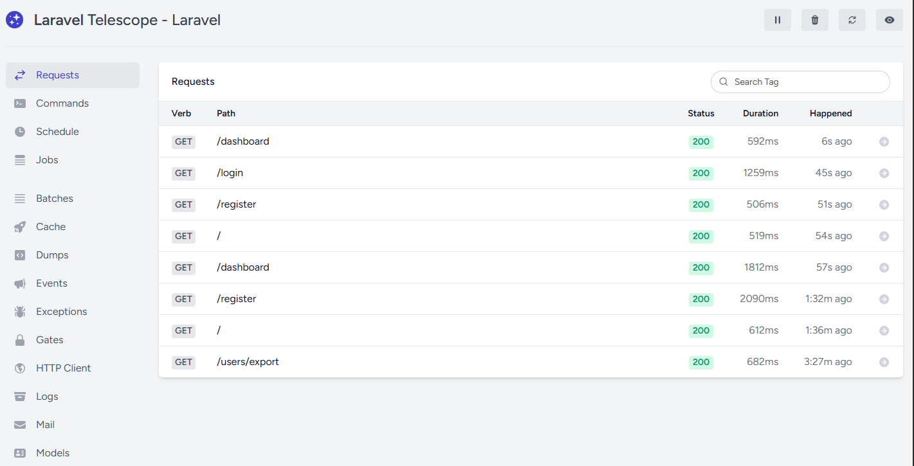

Requeriments

- php HP 8.2.12 (cli)
- npm 10.2.4
- node v20.11.0
- composer version 2.6.6 
- DB: mysql (utf8mb4_general_ci)

Implementations

- Laravel 10 https://laravel.com/docs/10.x
- Laravel Breeze https://laravel.com/docs/10.x/starter-kits#laravel-breeze
- Laravel Auditing https://laravel-auditing.com/
- Laravel Excel https://docs.laravel-excel.com/3.1/getting-started/installation.html

***
Solution Problem Version laravel excel: 

Ensure PHP is installed: If you're using XAMPP, WAMP, or another PHP environment on Windows, make sure it is correctly installed.

Install the gd extension for PHP: Open the php.ini configuration file, which is typically located in the PHP installation folder (for example, C:\xampp\php\php.ini or C:\wamp\php\php.ini).

Look for a line similar to this:

- ;extension=gd

Remove the semicolon (;) at the beginning of the line to enable the GD extension:

- extension=gd

Restart your web server: If you're using XAMPP, WAMP, or another server, restart it to apply the changes. You can restart the server using the control panel provided by your server environment.

After enabling the GD extension in the php.ini file, you can verify that it is enabled by running the following command in the terminal:

- php -m

This should list gd as one of the enabled modules. after:

a) Update the PHP version in the composer.json file to 8.2:

    "require": {
        "php": "^8.2",
        ...
    }

b) Run the following command to update the composer dependencies:

  - composer update

c) Install Laravel Excel:

 - composer require maatwebsite/excel

Forum: https://laracasts.com/discuss/channels/general-discussion/install-laravel-excel-with-laravel-10-and-php-82

test:  http://127.0.0.1:8000/users/export/

***
- Laravel telescope https://laravel.com/docs/10.x/telescope
    - test: http://127.0.0.1:8000/telescope/requests

***

php --version; 
PHP 8.2.12 (cli) (built: Oct 24 2023 21:15:15) (ZTS Visual C++ 2019 x64)
Copyright (c) The PHP Group
npm --version ; 
Zend Engine v4.2.12, Copyright (c) Zend Technologies
node --version;
10.2.4
composer --version;
v20.11.0
Composer version 2.6.6 2023-12-08 18:32:26

***
